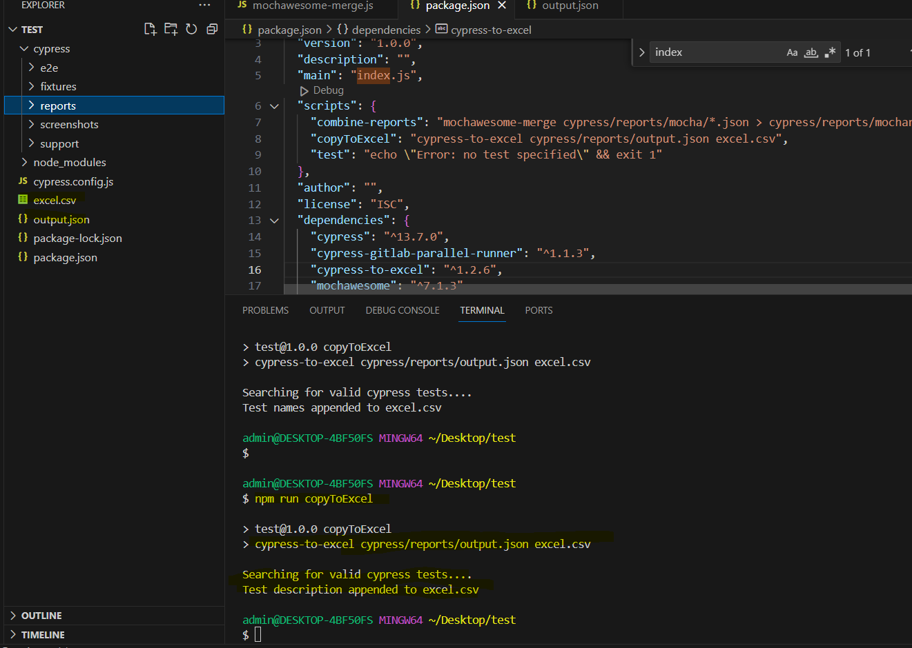
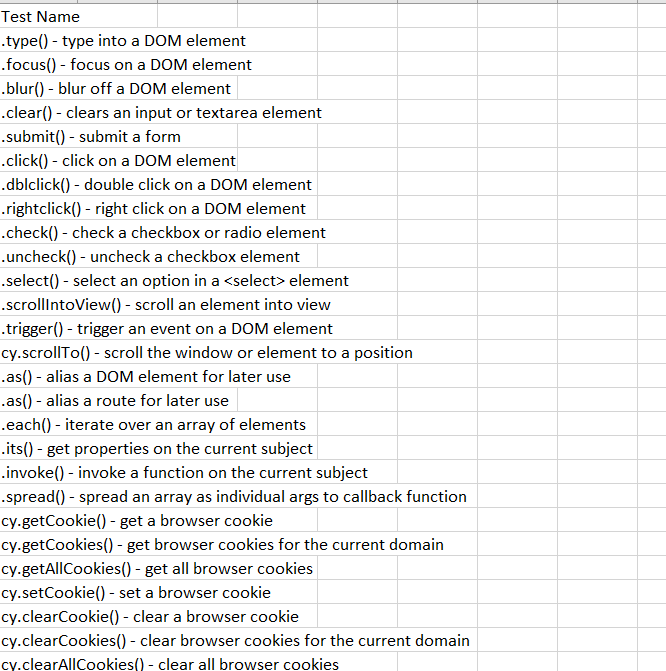

# Cypress To Excel Plugin

* The current scope of this plugin is that it copies the test names from cypress mochawesome report (combined report) to a excel sheet

## The Need

* Many people still use excel for sharing scenarios list that have been automated . This plugin is helpful for cases for those who prefer the actual code to be written and then the documentation

## Features
1. Single command to ease the  Creation of the excel file from json file
2. Single command to ease the automatic Updation of the excel file whenever new test cases are added for cypress
3. Does not write duplicate entry to the excel file
4. Records the description as given in the it() method
5. Currently supported format for output (.xls,.xlsx,.csv)

## Prerequisites
1. The Json report , preferably combined report i.e Mochawesome report must exist

## Installation 

npm i -g cypress-to-excel

* The above command shall install the plugin globally

## Usage

After having the merged report created,
In the package.json, add a script 
copyToExcel: cypress-to-excel `<path to the combined json report file name>`  `<path to the excel report file name>`

Execute `npm run copyToExcel`
## Example

Suppose json report exists in the cypress/report directory with file name as cypress/report/results.json and the excel file name that you would like to generate is test-results.xlsx
then in the package.json add the script as

copyToExcel: cypress-to-excel cypress/report/results.json  test-results.xlsx

## Screenshot of Plugin in action
1. On the cypress default scaffolded tests:

 
2. The excel generated:

## Future plan
1. Incorporation of the count of test cases that might have been duplicated by recording the occurence of each test case in new column
2. Serial number for tracking the test cases
3. To be able to display count of new test cases added/removed/modified